# cfb_pro_soccer_2026

> College football **and pro soccer** outlier finders. Two files (`cfb_edge.py`,
> `soccer_edge.py`), no API keys. The football half compares the
> **DraftKings** line (via ESPN) against **ESPN FPI's** game projection for every game on the
> Saturday slate, flags where the model and the market disagree, tracks open→current line
> movement, sizes quarter-Kelly tickets, and writes everything to SQLite so the edge (if
> any) can be **backtested honestly** in Python *and* R. The soccer half (added
> 2026‑09‑20) does the same for every league DraftKings prices through ESPN, with a
> self‑built Elo table standing in for the predictor ESPN does not publish for soccer —
> see [Pro soccer](#pro-soccer-soccer_edgepy).
>
> Sister project of [`horses_worldwide`](../horses_worldwide). Same philosophy: it reads
> public data and produces recommendations. **It does not place bets** — you place them
> yourself, and you log them here so the ledger tells you the truth.

---

## Before you bet — honest expectations (read this first)

**Nothing in this tool is proven +EV, and as of 2026‑09‑20 the tool says so on every
board: `STAKES: PAPER ONLY`.** The settled sample is 795 FBS‑vs‑FBS games and 578 paper
bets (the whole 2025 season backfilled from ESPN's closers + 2026 weeks 0–3 live). The
analysis loop was re‑run 2026‑09‑20 in both runtimes and they agree to the digit.

| Question (analysis/ script) | Answer (n=795 games / 578 paper bets) |
|---|---|
| Does the paper ledger make money? (`01`) | Flat ROI **−1.8%**, 95% CI [−11%, +7%] — inconclusive. Spread −5.9%, ML +1.9%, every kind × strength bucket inconclusive |
| Is FPI more accurate than the closer? (`02`) | RMSE **15.63 (FPI) vs 14.98 (DK)** — the closer wins by 0.65 pts |
| Does the FPI side cover? (`02`) | **48.4%** [45, 52] vs 52.4% break‑even — below break‑even, and worse the bigger the gap (Δ8+: **41.0%**) |
| Does following steam work? (`03`) | Moved‑toward side covers **47.6%** [42, 53]. Gating on "steam with FPI" does not help: 47.9% |
| Where exactly does it lose? (`04`) | STRONG ATS 46.7%; Δ8+ **42.5%**; ML dogs +100..+150 **30.2%** hit, −33% ROI; the model's ML win‑probs run 10–15 pp too high below 60% |

FPI is a real model and public lines are efficient. On this sample the market is simply
more right than FPI, and the plays the tool used to call STRONG are where FPI is *most*
wrong: the bigger the disagreement, the more likely the market knows something (QB out,
suspension, weather) that a power rating cannot. So the 2026‑09‑20 rules are:

- **No real‑money stakes** until a bucket's 95% CI clears zero (`LIVE_STAKES = False`).
  `$Bet` is what the paper ledger logs, not a recommendation.
- **Δ ≥ 8 is a demotion, not a promotion** (`SPREAD_OVERREACH_PTS`): capped at lean,
  tagged ⚠overreach.
- **ML dogs +100 to +150 are never staked** (`ML_DEAD_ZONE`): tagged ⚠dead‑zone‑dog.
- Line‑move gating stays informational; the data said it earns nothing.

The tool keeps flagging and paper‑logging everything so the sample keeps growing. What
turns stakes back on is `analysis/`, not a good Saturday.

---

## Quick start

```powershell
pip install -r requirements.txt

python cfb_edge.py                       # full Saturday board + top-10 outliers
python cfb_edge.py --top 15              # ranked outliers only
python cfb_edge.py --flagged             # board rows that carry a tag
python cfb_edge.py --picks               # only the tickets that clear every rule in betting_guide.md
python cfb_edge.py --bankroll 250        # resize the $Bet column
python cfb_edge.py --snapshot --report   # persist lines + FPI, paper-log plays, write reports/<weekday>-<date>.md
python cfb_edge.py --date 2026-09-19     # any date (default: next Saturday)

python soccer_edge.py --build-elo        # once: a year of results from every league -> soccer.db (~3 min)
python soccer_edge.py                    # today's soccer board, every league, Elo vs DK 3-way
python soccer_edge.py --top 15 --league eng.1,esp.1,ger.1,ita.1,fra.1
python soccer_edge.py --snapshot --report    # persist + paper-log + reports/soccer-<weekday>-<date>.md
```

Each `--report` is also published as a GitHub release so the pre‑kickoff board is frozen
somewhere you cannot quietly edit. Tags are `<weekday>-<date>`; a same‑day refresh gets a
suffix (`saturday-2026-09-12-morning`) and the earlier release stays put:

```powershell
gh release create saturday-2026-09-19 reports/saturday-2026-09-19.md --target main --latest --notes "picks + what changed"
```

Sunday morning:

```powershell
python cfb_edge.py --settle              # pull finals, grade paper bets + bets.csv
python cfb_edge.py --paper-show          # paper ledger by signal kind × strength
python cfb_edge.py --bets-show           # your real-money ledger with running ROI
```

Log a real ticket the moment you place it (game id is in the `--report` table or `data.db`):

```powershell
python cfb_edge.py --bet 401856782 --kind spread --side "Oklahoma State" --line 22.5 --price -110 --stake 5
python cfb_edge.py --bet 401856782 --kind ml --side Oregon --price -1800 --stake 10
python cfb_edge.py --bet 401856782 --kind under --line 57.5 --price -108 --stake 5
```

Seed the database with past weeks (ESPN keeps the opener, the closer and the pre‑game FPI
for finished games):

```powershell
python cfb_edge.py --date 2026-09-05 --backfill
```

### The GUI (optional)

Everything above also has a point-and-click front end. It is a local web page served by
the Python standard library — no extra install, nothing leaves your machine:

```powershell
python cfb_gui.py                 # serves http://127.0.0.1:8765 and opens your browser
python cfb_gui.py --port 9000 --no-browser
```

Tabs: **Board** (sortable, filter to flagged / not-kicked), **Top plays** (ranked outliers
with a *bet…* button that pre-fills the ticket form), **Paper ledger**, **Real bets**
(log a ticket = `--bet`), **Actions** (snapshot / settle / report / backfill, each asks
before writing). It imports `cfb_edge.py` and calls the same functions the CLI does, so a
number on the page is the number the terminal prints. Pressing *Load slate* reuses the
last fetch; *Refresh* goes back to ESPN. Actions always re-fetch first, exactly like the CLI.

### Setting up a fresh Windows machine

Everything is PowerShell. Verify each step before the next.

```powershell
winget install Python.Python.3.13          # then close + reopen PowerShell
python --version                           # expect 3.12 or newer (CI tests 3.12 and 3.13)

winget install RProject.R                  # optional: only needed for the R half of the analysis loop
# then put C:\Program Files\R\R-4.4.2\bin on the PATH — see "Getting Rscript on the PATH" below

winget install Git.Git GitHub.cli          # optional: gh cuts the weekly releases and does CI/branch-protection admin
git clone https://github.com/wbp318/cfb_pro_soccer_2026.git
cd cfb_pro_soccer_2026
pip install -r requirements.txt            # runtime: just `requests`
pip install -r analysis/requirements-py.txt -r requirements-dev.txt   # pandas/numpy + ruff/pytest
python cfb_edge.py --top 10                # first live run — should print next Saturday's outliers
python -m pytest -q tests                  # 65 passed
```

No API keys, no `.env`, nothing to sign up for. If the first live run prints a 403, read
the User‑Agent note under *Data sources and gotchas*.

### Every flag

| Flag | Does | Touches network? | Writes? |
|---|---|---|---|
| *(none)* | full board for next Saturday + top‑10 ranker | yes | no |
| `--date YYYY-MM-DD` | any date instead of next Saturday (weeknight games work too) | yes | no |
| `--top N` | ranked outliers only, N rows | yes | no |
| `--flagged` | board rows that carry at least one tag | yes | no |
| `--picks` | picks board only: ATS/ML tickets that clear every rule in `betting_guide.md` (FBS vs FBS, no ⚠ flag, positive stake, one per game, max 5) | yes | no |
| `--bankroll X` | bankroll for the `$Bet` column (default 100) | — | no |
| `--no-color` | plain text (auto when piped) | — | no |
| `--snapshot` | persist games + lines + FPI to `data.db`; paper‑log every strength ≥ 1 play | yes | `data.db` |
| `--report` | also write `reports/<weekday>-<date>.md` (implies a snapshot of lines) | yes | `data.db`, `reports/` |
| `--backfill` | with a **past** `--date`: snapshot closers + pre‑game FPI, paper‑log with `backfill=1`, then settle | yes | `data.db` |
| `--settle` | refresh scores, grade `paper_bets` and `bets.csv`, print the paper summary | yes | `data.db`, `bets.csv` |
| `--paper-show` | paper ledger by kind × strength | no | no |
| `--bets-show` | real‑money ledger with running P&L and ROI | no | no |
| `--bet ID --kind K --side S --line L --price P --stake $ [--note …]` | append one real ticket to `bets.csv` | yes (to find the game) | `bets.csv` |
| `--db PATH` | use another SQLite file (CI uses a scratch one) | — | — |

`--bet` rules: `--kind` is `spread`, `ml`, `over` or `under`. `--side` must be the team's
display name (`"Oklahoma State"`), its ESPN abbreviation is **not** enough for settlement, and
for `over`/`under` it is ignored. `--line` is the number *you got* from the side's point of view
(`+22.5` for the dog, `-22.5` for the favorite, `57.5` for a total); `--price` defaults to −110.

---

## The full picture

Six moving parts. One of them talks to the internet (`cfb_edge.py`), one holds the truth
(`data.db`), and everything else exists to check that the first one is not fooling you.

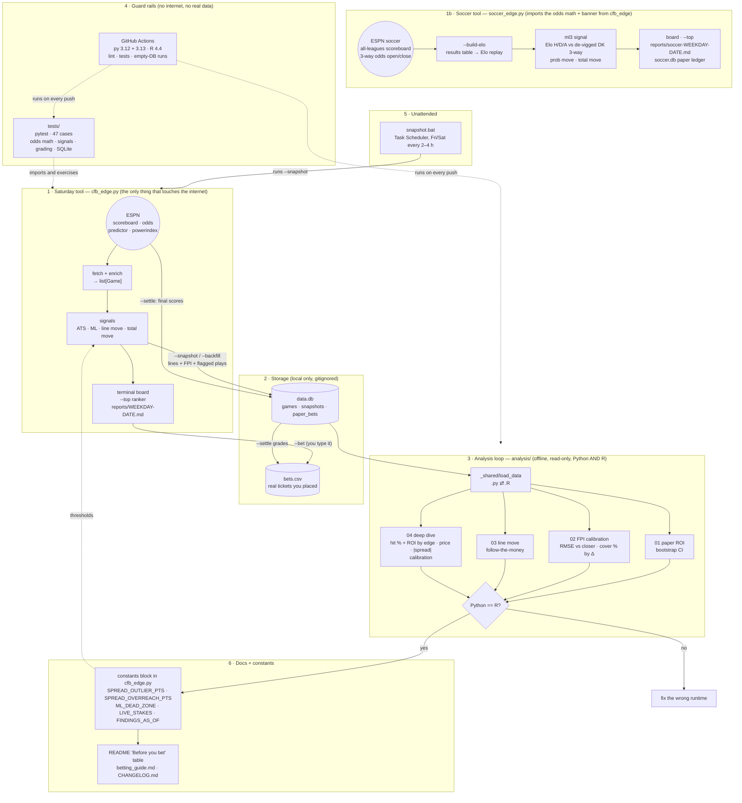

**How to read it.** Saturday morning the tool pulls ESPN, scores every game with the four
signals, prints the board, and (with `--snapshot`) writes the lines, the FPI numbers and
every flagged play into `data.db`. You place tickets by hand and log them with `--bet`.
Sunday `--settle` pulls finals and grades both the paper plays and your real tickets. The
analysis scripts then read `data.db` in two languages; when they agree, their verdicts are
the only thing allowed to change the thresholds at the top of `cfb_edge.py`. Tests and CI
sit outside the loop and make sure a code change did not silently change what a "STRONG
ATS" means.

### Inside `cfb_edge.py` — what each flag does

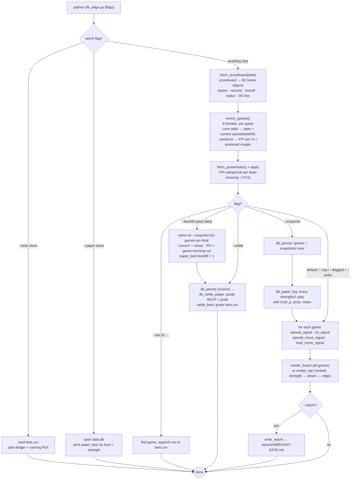

### Inside `analysis/` — what each script asks

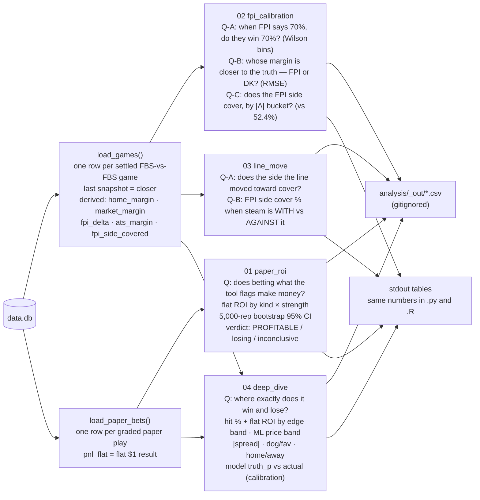

The R and Python versions of each script share the same SQL string, the same bins, and the
same closed-form Wilson interval, so their point estimates must be identical. Only the
bootstrap CIs in `01` are allowed to differ in the last digit.

---

## How it works

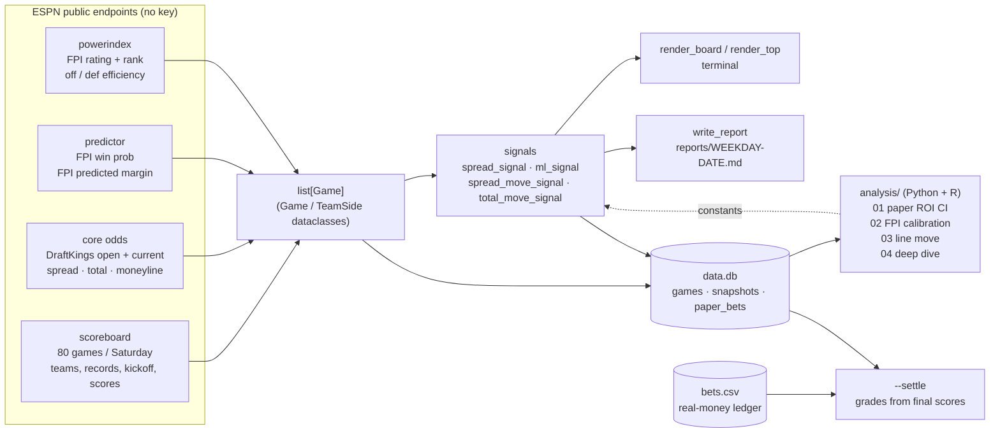

### The signals, in trust order

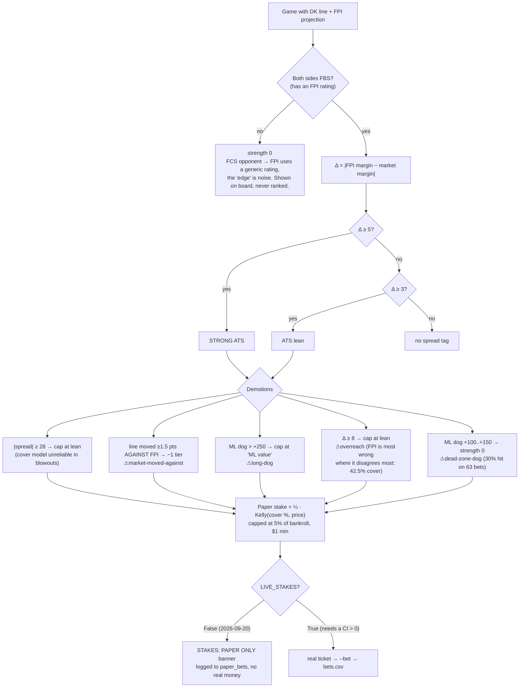

| Signal | What it compares | Fires | Stake? |
|---|---|---|---|
| **ATS** (`spread_signal`) | FPI predicted margin vs DK spread | Δ ≥ 3 pts (lean), 5 ≤ Δ < 8 (STRONG), Δ ≥ 8 capped at lean (⚠overreach) | paper — cover % = Φ(Δ / 13.5) |
| **ML** (`ml_signal`) | FPI win prob vs de‑vigged DK moneyline | edge ≥ +8% (value), ≥ +20% (STRONG); +100..+150 dogs never (⚠dead‑zone‑dog) | paper — truth p = FPI win prob |
| **line move** (`spread_move_signal`) | DK opener vs current | ≥ 3 pts | no — it's news (QB, injury, weather), not a model |
| **total steam** (`total_move_signal`) | DK total opener vs current | ≥ 2.5 pts | no — there is no totals model here |

The board also prints `[steam with]` / `[steam against]` whenever the spread moved ≥1.5 pts
since open, and `[crosses 3,7]` when the FPI number and the market number sit on opposite
sides of a key number.

### The arithmetic, with one worked game

Take Cal at Syracuse from the 2026‑09‑12 morning board: DK has Syracuse −3.5 (−115),
moneyline SYR −192 / CAL +160, and FPI projects Syracuse to win by 11.6 with an 80% win
probability.

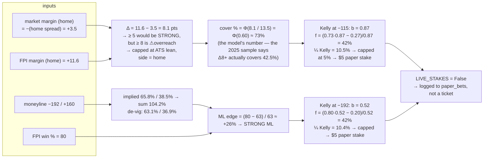

Syracuse lost 18–21. Under the 2026‑09‑12 rules this was the top play on the board (STRONG
ATS + STRONG ML + steam with). Under the 2026‑09‑20 rules it is an ATS lean tagged
⚠overreach and a paper ML stake, and the board says PAPER ONLY above it. That is the whole
change in one game.

- **Market margin** is just the spread with the sign flipped, from the home team's point of view.
- **Δ** is the disagreement in points. Sign tells you which side FPI likes; size sets the tier.
- **Cover %** assumes the true margin is normal around FPI's number with SD 13.5 (`MARGIN_SD`).
  Historically the closer's error in FBS is 13–14 pts; the `02` script reports the live RMSE so
  the constant can be re‑tuned. This is the biggest modelling assumption in the tool.
- **De‑vig** divides each implied probability by their sum so the pair adds to 100%. The
  multiplicative method is used; it slightly favours the dog compared with the "power" method.
- **Kelly** uses the model probability as the truth, which is exactly the thing the analysis loop
  is testing. That is why stakes are quarter‑Kelly *and* capped at 5% of bankroll: if FPI is
  only 53% right instead of 73%, quarter‑Kelly on the wrong number still bleeds slowly instead
  of fast.
- **Key numbers** (3, 7, 10, 14) are where FBS margins bunch up. `[crosses 7,10]` means FPI's
  number and the market's sit on opposite sides of 7 and 10, so a half‑point either way matters
  more than usual.

### The weekly loop

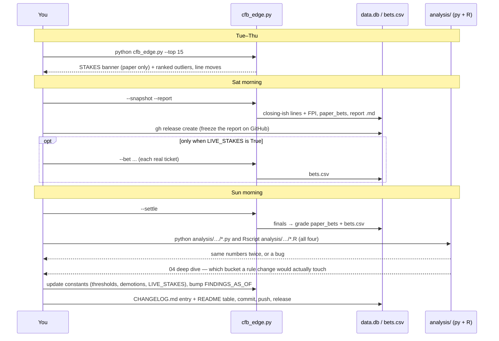

`snapshot.bat` is the Task‑Scheduler wrapper: run it every 2–4 h Friday/Saturday so the DB
holds a near‑opener and a near‑closer for every game (closing‑line‑value tracking).

**Setting up the unattended snapshot** (one‑time, PowerShell as your normal user):

```powershell
$action  = New-ScheduledTaskAction -Execute "C:\Users\wbp31\cfb_2026\snapshot.bat"
$trigger = New-ScheduledTaskTrigger -Once -At "06:00" -RepetitionInterval (New-TimeSpan -Hours 3) -RepetitionDuration (New-TimeSpan -Hours 18)
Register-ScheduledTask -TaskName "cfb_snapshot" -Action $action -Trigger $trigger -Description "cfb_edge --snapshot every 3h"
```

That fires 6 AM → midnight every day at three‑hour spacing; the tool is cheap enough (about
170 small HTTP calls) that running it on weekdays too is fine and gives you Tuesday openers.
`snapshot.log` in the repo folder collects the output; it is gitignored. Delete the task with
`Unregister-ScheduledTask -TaskName cfb_snapshot`.

---

## Reading the board

```
Kick CT     Matchup                 DK spread (open)      FPI mrg     Δ  Cov%  ML home/away    FPI%  Total (open)   Tag / $Bet
sat 02:30pm CAL @ SYR               SYR -3.5 (+1.5)         +11.6   8.1    73  -192/+160         80  56.5 (52.5)    STRONG ATS SYR -3.5 [steam with] [crosses 7,10] $5 · STRONG ML SYR -192 (+26%) $5
```

- **DK spread (open)** — home team's number now, opener in parentheses. Syracuse opened +1.5, now −3.5: five points of steam toward the home side.
- **FPI mrg** — FPI's predicted *home* margin. +11.6 means FPI has Syracuse by nearly 12.
- **Δ / Cov%** — |FPI − market| in points and the implied cover probability of the FPI side.
- **FPI%** — FPI home win probability, to compare with the moneyline.
- **Tag / $Bet** — green STRONG, cyan lean/value, red when the market moved against the model. Dollar figure is the quarter‑Kelly ceiling for the `--bankroll` given.
- **Total (open)** — DK total now, opener in parentheses. `total steam ▲4` means it moved four points since open. There is no totals model; the number is context only.
- A trailing `[in 14-7]` or `[post 31-24]` means the game has started or finished (away‑home score) and the row is display only — it is never ranked or paper‑logged.

### What the ledgers look like

`--paper-show` after the week 0–1 backfill:

```
paper bets — settled by kind/strength (pending: 0)
kind        str    n   W   L   P   staked   profit     ROI
ml            2    4   2   2   0    17.00     9.10  +53.5%
ml            1   14   5   9   0    33.00   -18.53  -56.2%
spread        2    3   1   2   0    15.00    -5.76  -38.4%
spread        1   13   7   5   1    62.00     7.89  +12.7%
```

`str` is the strength tier (2 STRONG, 1 lean/value). Stakes are what quarter‑Kelly would have
put down on a $100 bankroll at the time. Small n, wide swings — exactly why `01` bootstraps a CI
before anyone reads a per‑row ROI as a signal.

`--bets-show` prints one line per real ticket with `res` (W/L/P, or `·` while pending) and a
running net, then the settled stake, net and ROI at the bottom.

### What is stored

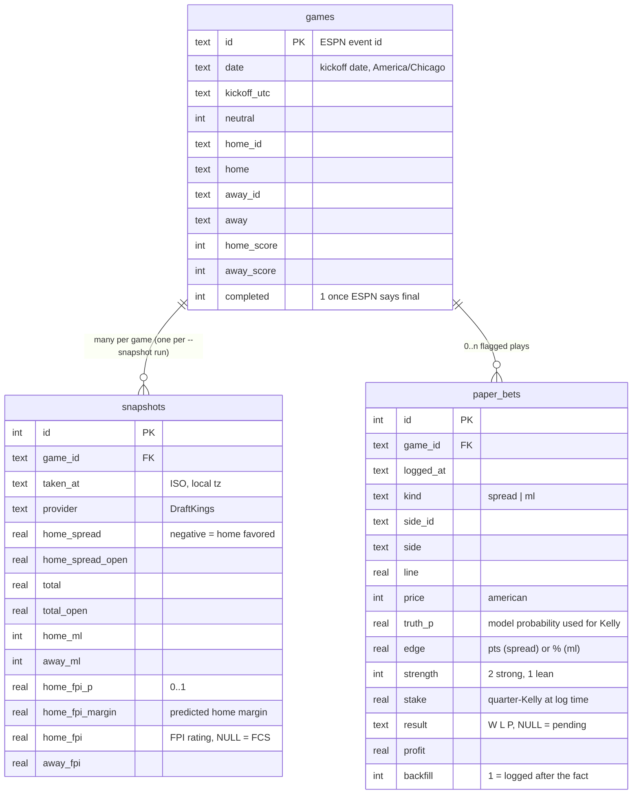

`bets.csv` (your real tickets) has: `logged_at, date, game_id, matchup, kind, side, line,
price, stake, result, profit, settled_at, note`. It is a plain CSV so you can open it in
Excel, but let `--settle` fill `result`/`profit` rather than typing them.

Every `--snapshot` adds a **new** row to `snapshots` rather than updating, so the table is a
time series of the line. `analysis/_shared/load_data` takes the last row per game as "the
closer"; the first row is your best proxy for "where you could have bet". The gap between the
two is closing‑line value, the most reliable early indicator of whether a bettor has an edge.

---

## The analysis loop (Python and R, side by side)

Every script exists twice and must print the **same point estimates**. Bootstrap confidence
intervals may differ in the last digit (different RNG streams) — everything else must match,
and a disagreement means a bug.

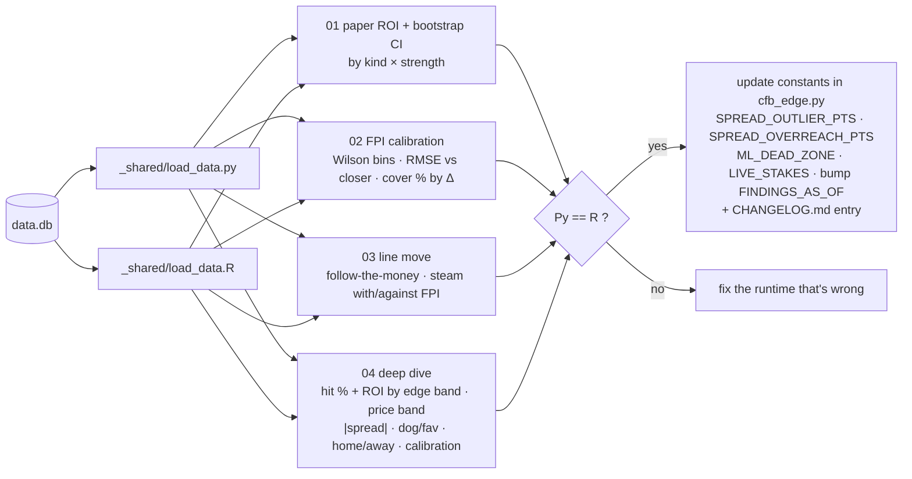

### Getting `Rscript` on the PATH (one-time)

**Why bother.** The analysis loop only works as a *check* if you run every script twice,
once in Python and once in R, and compare the numbers. `Rscript` is the command-line R
runner that makes the R half a one-liner (`Rscript analysis/…/paper_roi.R`) instead of
opening RStudio, setting the working directory, and clicking Source. PATH is the list of
folders PowerShell searches when you type a command; R's installer does **not** add its
`bin` folder to it, so `Rscript` is "not recognized" in a fresh window even though R is
installed. Putting `C:\Program Files\R\R-4.4.2\bin` on the PATH once means `Rscript` works
from any folder, in any window, and inside `snapshot.bat` / Task Scheduler / Claude Code
without hard-coding the full path everywhere. It is the same reason `python` works: the
Python installer offered the "Add to PATH" checkbox and R's did not.

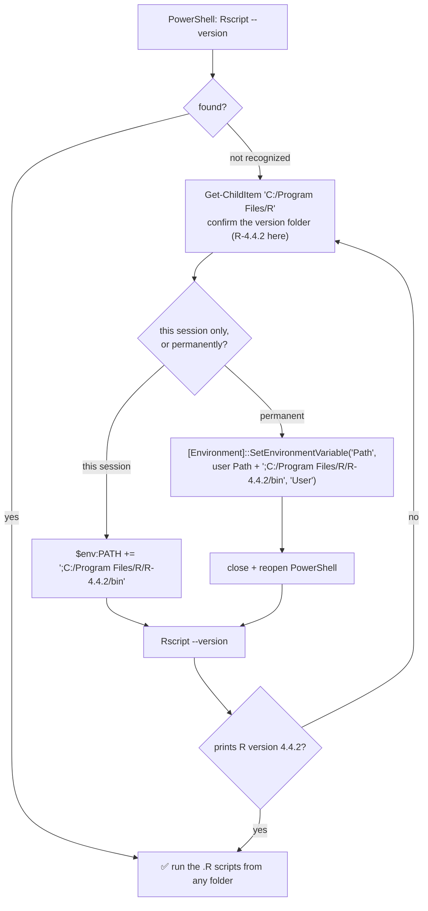

*(Forward slashes in the diagram only, because Mermaid eats backslashes. Windows accepts either.)*

**What "permanently" actually does.** Windows keeps two PATH lists in the registry: a
*machine* list (all users, needs admin) and a *user* list (just you, no admin). Every
program builds its own PATH **once, at start-up**, by reading `machine ; user` from the
registry. That is why a window that was already open never sees the change, and why
"close + reopen" is a real step, not superstition. On this machine the R folder was added
to the **user** list on 2026‑09‑09.

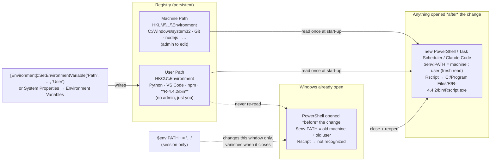

Three ways to reach the same result, and where each one lives:

| Method | Scope | Survives reboot? | Admin? |
|---|---|---|---|
| `$env:PATH += ';C:\Program Files\R\R-4.4.2\bin'` | this window only | no | no |
| `[Environment]::SetEnvironmentVariable('Path', …, 'User')` | your account, every new window | **yes** | no |
| System Properties → Environment Variables → *System variables* → Path | every account | yes | yes |

To **undo**: System Properties → Environment Variables → *User variables* → Path → remove
the R entry. When you **upgrade R** the folder name changes (`R-4.5.0`), so swap the entry.

```powershell
# permanent, current user — run once, then reopen PowerShell
[Environment]::SetEnvironmentVariable('Path',
  [Environment]::GetEnvironmentVariable('Path','User') + ';C:\Program Files\R\R-4.4.2\bin', 'User')

# or just for this window
$env:PATH += ';C:\Program Files\R\R-4.4.2\bin'
Rscript --version
```

```powershell
pip install -r analysis/requirements-py.txt
python analysis/01_paper_roi_ci/paper_roi.py
python analysis/02_fpi_calibration/fpi_calibration.py
python analysis/03_line_move/line_move.py
python analysis/04_deep_dive/deep_dive.py

# R (install packages once; see the PATH diagram above)
Rscript -e 'install.packages(readLines("analysis/requirements-r.txt"), repos="https://cloud.r-project.org")'
Rscript analysis/01_paper_roi_ci/paper_roi.R
Rscript analysis/02_fpi_calibration/fpi_calibration.R
Rscript analysis/03_line_move/line_move.R
Rscript analysis/04_deep_dive/deep_dive.R
```

Outputs land in `analysis/_out/` (gitignored). See [`analysis/README.md`](analysis/README.md).

---

## CI

Every push to `main` and every pull request runs `.github/workflows/ci.yml`. Nothing in
CI touches ESPN — the point is to catch syntax, lint, schema and runtime-drift bugs before
they reach the laptop on a Saturday morning.

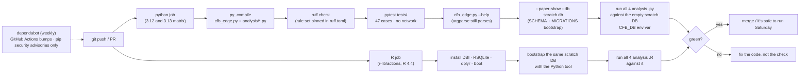

The `CFB_DB` environment variable points both loaders at a scratch database; without it
they read `data.db` in the repo root. Locally you can reproduce the CI checks with:

```powershell
pip install -r requirements-dev.txt
ruff check cfb_edge.py cfb_gui.py analysis tests
python -m pytest -q tests
python cfb_edge.py --paper-show --db $env:TEMP\ci.db
$env:CFB_DB = "$env:TEMP\ci.db"; python analysis/01_paper_roi_ci/paper_roi.py; Rscript analysis/01_paper_roi_ci/paper_roi.R
Remove-Item Env:CFB_DB
```

---

## Data sources and gotchas

- **ESPN scoreboard** `site.api.espn.com/.../scoreboard?dates=YYYYMMDD&groups=80&limit=300` — the whole FBS slate incl. FCS visitors. Only one book is exposed (DraftKings).
- **ESPN core odds** `sports.core.api.espn.com/.../events/{id}/competitions/{id}/odds` — has `open` **and** `current` for spread, total and moneyline. For finished games `current` is frozen at the closer, which is what makes `--backfill` possible.
- **ESPN predictor** `.../competitions/{id}/predictor` — FPI `gameProjection` (win %) and `teamPredPtDiff` (margin). `lastModified` is the game‑morning run, so backfilled FPI is genuinely pre‑game.
- **ESPN powerindex** `site.web.api.espn.com/apis/fitt/v3/.../powerindex` — 138 FBS teams. A team missing here is FCS; the tool uses that as the "don't trust the edge" flag.
- **User‑Agent**: a full Chrome UA string gets a **403** from ESPN's Akamai edge; a plain `Mozilla/5.0` passes. Don't "improve" it.
- **Not used**: CollegeFootballData (needs a key), The Odds API (needs a key), Massey (403 to scripts). Multi‑book line shopping would need one of the keyed APIs — the hook is `_apply_core_odds`.

## Troubleshooting

| Symptom | Cause | Fix |
|---|---|---|
| `403 Client Error: Forbidden` on the first fetch | ESPN's Akamai edge rejects browser‑looking User‑Agent strings from non‑browsers | leave `UA = {"User-Agent": "Mozilla/5.0"}` alone; if ESPN changes again, try the bare `requests` default |
| `UnicodeEncodeError: 'charmap' codec` | Windows console is cp1252; output has Δ, ≥, → | already handled in `main()` and the analysis loader; if you see it, you are on a very old Python — upgrade |
| `0 games · 0 with DK line` | wrong date, or ESPN has not published the slate | check `--date`; weeknight dates only have a few games; FCS‑only days show nothing under `groups=80` |
| board has FPI but `—` for the spread | DK has not posted that game yet (common Sunday–Tuesday for small conferences) | re‑run later; `--snapshot` records whatever exists |
| a huge Δ on a game you have never heard of | FCS opponent; FPI's rating for them is a placeholder | expected — it is shown but never ranked or staked (`⚠non-FBS side`) |
| `--settle` grades nothing | games not final yet, or `data.db` has no `games` rows for that date | run after Sunday morning; make sure a `--snapshot` (or `--backfill`) captured the date first |
| `Rscript` not recognized | not on PATH | see the PATH section |
| `package 'RSQLite' is not available` | not installed in this R | `Rscript -e 'install.packages(readLines("analysis/requirements-r.txt"), repos="https://cloud.r-project.org")'` |
| Python and R print different numbers | a real bug in one of them | the SQL, bins and Wilson formula must be identical; diff the two files, fix the wrong one, add a test |

## Glossary

- **ATS** — against the spread. A −3.5 favorite "covers" by winning by 4+.
- **ML** — moneyline, a bet on who wins. `−166` risks 166 to win 100; `+140` risks 100 to win 140.
- **Opener / closer** — the first line a book posts and the last one before kickoff. The closer
  is the sharpest public estimate of the game; beating it consistently (**CLV**, closing line
  value) is the standard test of a real edge.
- **Steam** — a fast line move from sharp money or news. `[steam with]` means it moved toward
  FPI's side; `[steam against]` means away.
- **Key numbers** — margins FBS games land on most: 3, 7, 10, 14. Crossing one is worth more
  than the half‑point suggests.
- **De‑vig** — remove the bookmaker's margin so the two moneylines sum to 100%.
- **Kelly** — the stake fraction that maximises long‑run growth if your probability is right;
  quarter‑Kelly is the usual hedge against it being wrong.
- **FPI** — ESPN's Football Power Index: a rating per team plus a per‑game win probability and
  predicted margin. Public, keyless, updated overnight.
- **Δ (delta)** — |FPI margin − market margin| in points. Our single biggest input.
- **Paper bet** — a play the tool would have made, recorded and graded with no money on it.
- **Wilson interval** — a confidence interval for a proportion that behaves on small n; used
  for every cover‑rate and calibration bin in `analysis/`.
- **Bootstrap** — resample the bets with replacement 5,000× to get a CI on ROI without assuming
  a distribution.

## Pro soccer (`soccer_edge.py`)

Added 2026‑09‑20. Same shape as the football tool, three differences:

1. **Every league.** ESPN's `soccer/all/scoreboard` lists every match on a date (219
   leagues in the catalogue: Premier League to the Bolivian Liga Profesional, NCAA, women's
   leagues, cups, qualifiers). DraftKings prices most of them through ESPN's core odds
   record: three‑way moneyline, Asian spread and total, each with open / current / close.
2. **No ESPN predictor for soccer.** The model side is an Elo table the tool builds itself:
   `--build-elo` walks every day from 2025‑07‑01 to today, stores every final score in
   `soccer.db`, and replays them chronologically (K = 20, half for friendlies, home
   advantage 60 Elo, goal‑difference multiplier as in World Football Elo). Ratings are
   never stored, only replayed, so a past date's rating is exactly what was known then and
   `--backfill` is honest.
3. **Three outcomes.** Elo gives an expected score; the draw gets `DRAW_BASE` (26%) at parity
   shrinking as 4E(1−E), and the remainder is split to preserve the expected score. That
   split is the weakest assumption in the module, so **draw picks are capped at "value"**.

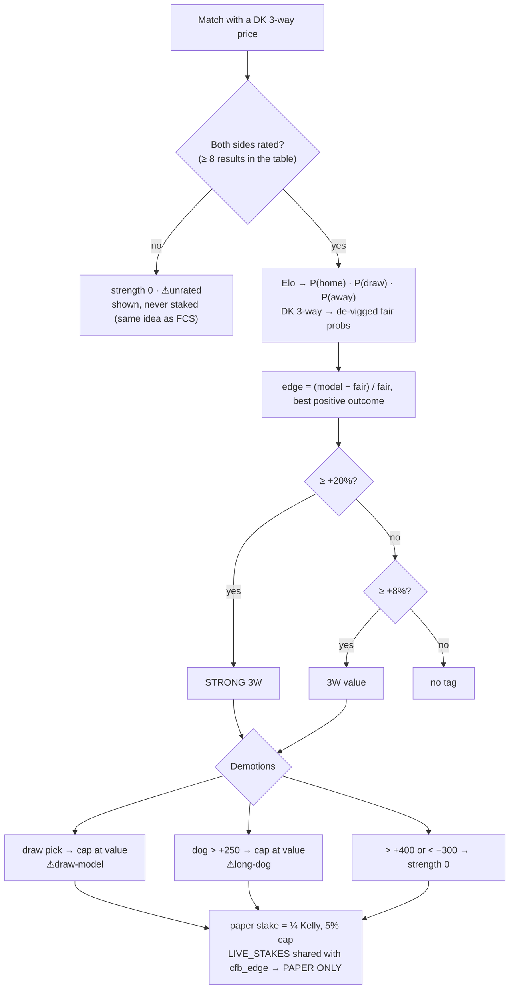

| Flag | What |
|---|---|
| `--build-elo [--since D]` | fetch and store results from `--since` (default 2025‑07‑01) to `--date`; re‑runs only fetch missing days |
| *(none)* | today's board, every league, then the top‑10 |
| `--league eng.1,esp.1` | keep only these ESPN slugs (`soccer_leagues.json` is the id → slug cache) |
| `--top N` / `--flagged` | ranked outliers only / tagged rows only |
| `--snapshot --report` | persist lines + Elo, paper‑log flagged plays, write `reports/soccer-<weekday>-<date>.md` |
| `--settle` | refresh finals for `--date`, store them as results, grade the paper ledger |
| `--date D --backfill` | past date: closers + Elo‑as‑of, paper‑log with `backfill=1`, settle |
| `--elo-show N` | print the top‑N Elo table |
| `--paper-show` | soccer paper ledger by pick × strength |

**Honest status.** No soccer analysis run exists yet. Every constant in the soccer block is a
prior, the paper ledger in `soccer.db` is the first thing that will say whether Elo‑vs‑DK is
anything, and the banner says PAPER ONLY on every soccer board because `LIVE_STAKES` is shared.
Football's lesson applies in advance: the biggest disagreements are where the market most
likely knows something the rating does not. First backfill (2026‑09‑12/13, 229 paper bets,
closers + Elo‑as‑of): flat ROI **−14.7%**; STRONG +3.1% on 88, value −35% on 141. Two days,
no verdict, paper only.

## Roadmap (only if the numbers earn it)

- **Soccer analysis twins.** `soccer.db` has the same shape as `data.db` (matches · snapshots ·
  paper_bets · results). An `analysis/05_soccer_*` pair (Python + R) that grades the 3‑way
  ledger by pick, price band and edge band, fits `DRAW_BASE` and `ELO_HFA` on the results table,
  and reports Elo calibration is the next thing to build once a few weekends are settled.

- **Multi‑book line shopping.** ESPN exposes only DraftKings. A keyed API (CollegeFootballData
  or The Odds API, both free tiers) would add FanDuel/Caesars/BetMGM and turn "FPI vs DK" into
  "FPI vs the best available number". The adapter hook is `_apply_core_odds`.
- **CLV report.** `snapshots` already holds the time series; a `04_clv/` twin that compares the
  line at paper‑log time with the closer would answer "are we beating the close?" before the
  win/loss sample is large enough to say anything.
- **Totals model.** None today; `total steam` is context only. Off/def efficiency from the
  powerindex is captured but unused.
- **Blend.** `02` reports a 50/50 FPI+closer RMSE. If the blend beats both, `MARGIN_SD` and the
  side selection should use it. Only after both runtimes agree on more than a month of data.

## License

**Proprietary — all rights reserved.** The code and the play rules are viewable here for
transparency, but they are not open source: no copying, running, deploying, or using the
signals to set or advise on lines without a written license. Commercial licenses (including
an outright sale) are available to sportsbooks and handicappers — see [LICENSE](LICENSE) and
contact William Brooks Parker via [github.com/wbp318](https://github.com/wbp318).

## Files

| File | What |
|---|---|
| `cfb_edge.py` | the football tool — everything lives here, section headers navigate it |
| `soccer_edge.py` | the soccer tool — every league, self-built Elo vs DK 3-way; imports odds math + banner from `cfb_edge` |
| `cfb_gui.py` | optional local browser dashboard over `cfb_edge.py` (stdlib only) |
| `betting_guide.md` | live‑play reference: thresholds, what to fire on, discipline |
| `CLAUDE.md` | conventions for Claude Code |
| `analysis/` | Python + R twins, offline, read‑only |
| `tests/` | pytest unit tests, no network — run `python -m pytest -q tests` |
| `.github/` | CI workflow + dependabot (Actions weekly; pip security‑only) |
| `ruff.toml`, `requirements-dev.txt` | lint config and dev deps (ruff, pytest) |
| `reports/` | `<weekday>-<date>.md` (football) and `soccer-<weekday>-<date>.md` — what the tool said before kickoff; each one is also a GitHub release |
| `CHANGELOG.md` | every rule/constant change and fix, with the analysis run that justified it |
| `snapshot.bat` | Task Scheduler wrapper |
| `data.db`, `soccer.db`, `soccer_leagues.json`, `bets.csv` | local only, gitignored |
