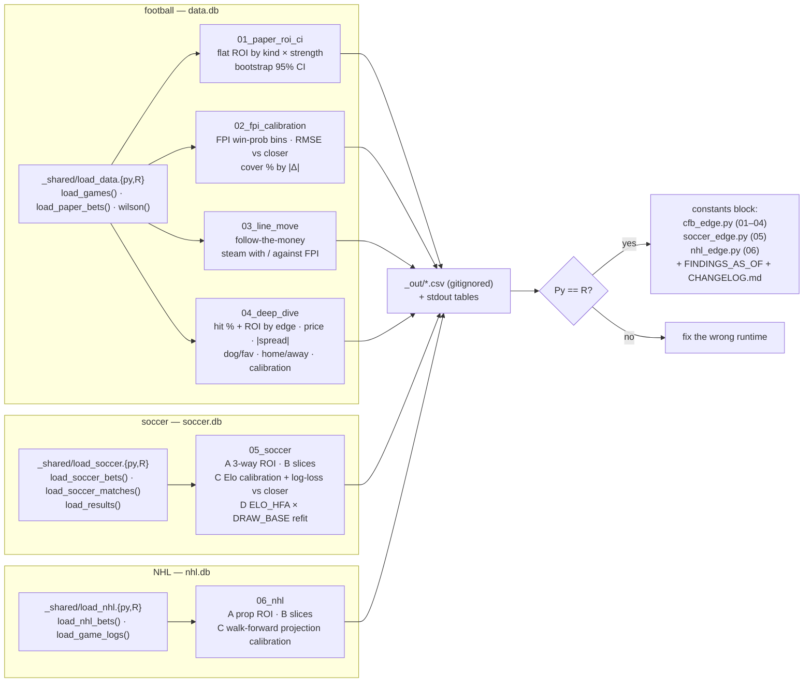

# analysis/

Offline analysis of `data.db`. **Not part of the live `cfb_edge.py` tool** — these scripts
only read; they never write to `data.db` or `bets.csv`.

Each analysis ships in two flavors, kept in lockstep on purpose:

- **R** (`.R`) — `DBI`, `RSQLite`, `dplyr`, `boot`.
- **Python** (`.py`) — `pandas`, `numpy`. Same SQL, same bins, same conclusions.

If Python and R disagree on a point estimate, something is wrong. Bootstrap CIs may differ
in the last digit (different RNG streams); Wilson intervals are closed-form and must match.

## Layout




- `_shared/load_data.{py,R}` — `load_games()` (one row per settled FBS-vs-FBS game with the
  last-snapshot line and pre-game FPI) and `load_paper_bets()`; `wilson()` helper.
- `_shared/load_soccer.{py,R}` — the soccer twin over `soccer.db`: `load_soccer_bets()`,
  `load_soccer_matches()` (last snapshot = closer + Elo probs, de-vigged 3-way fair probs,
  outcome) and `load_results()` (every stored final, chronological). `CFB_SOCCER_DB` overrides.
- `01_paper_roi_ci/` — flat-bet ROI of the paper ledger by kind × strength, bootstrap 95% CI.
- `02_fpi_calibration/` — FPI win-prob calibration; RMSE of FPI vs closer vs blend; FPI-side
  cover rate by |Δ| bucket vs the 52.4% break-even.
- `03_line_move/` — does the side the line moved toward cover? FPI-side cover rate when
  steam is with vs against the model.
- `04_deep_dive/` — where exactly does the paper ledger win and lose? Hit % (Wilson CI) and
  flat ROI by edge band, ML price band, |spread|, dog/fav, home/away, and model truth_p vs
  actual. This is the "simulate before you change a rule" script; it produced the 2026-09-20
  demotions (`SPREAD_OVERREACH_PTS`, `ML_DEAD_ZONE`) and `LIVE_STAKES = False`.
- `_shared/load_nhl.{py,R}` — `load_nhl_bets()` (settled props with pnl_flat) and
  `load_game_logs(season)` over `nhl.db`. `CFB_NHL_DB` overrides.
- `06_nhl/` — the NHL loop: A. prop ROI by market × side × strength (bootstrap CI); B. slices
  by edge band, market, side; C. walk-forward projection calibration on the stored game logs
  (shrinkage + recent-10 tilt + Poisson, same recipe as `nhl_edge.calibrate`): log-loss vs the
  naive league-average model and reliability bins for shots / points / saves. A and B are empty
  until the season opens; C runs today and must match `nhl_edge.py --calibrate` exactly.
- `05_soccer/` — the whole loop for `soccer_edge.py` in one script: A. 3-way paper ROI by
  pick × strength with bootstrap CI; B. slices by edge band, price band, pick; C. Elo
  calibration (binned model prob vs observed) and 3-way log-loss vs the de-vigged closer;
  D. refit of `ELO_HFA` × `DRAW_BASE` by held-out log-likelihood on the results table. The
  Elo replay is re-implemented in both runtimes (it is 20 lines) and must match
  `soccer_edge.elo_update` — if you change K, the goal-difference multiplier or the friendly
  weight there, change it here.
- `_out/` — CSV outputs, gitignored.

## Running

From the project root:

```powershell
pip install -r analysis/requirements-py.txt
python analysis/01_paper_roi_ci/paper_roi.py
python analysis/02_fpi_calibration/fpi_calibration.py
python analysis/03_line_move/line_move.py
python analysis/04_deep_dive/deep_dive.py
python analysis/05_soccer/soccer_loop.py
python analysis/06_nhl/nhl_loop.py

$env:PATH += ";C:\Program Files\R\R-4.4.2\bin"
Rscript -e 'install.packages(readLines("analysis/requirements-r.txt"), repos="https://cloud.r-project.org")'
Rscript analysis/01_paper_roi_ci/paper_roi.R
Rscript analysis/02_fpi_calibration/fpi_calibration.R
Rscript analysis/03_line_move/line_move.R
Rscript analysis/04_deep_dive/deep_dive.R
Rscript analysis/05_soccer/soccer_loop.R
Rscript analysis/06_nhl/nhl_loop.R
```

## "Settled" means

`games.completed = 1 AND home_score IS NOT NULL AND away_score IS NOT NULL`. That is the
whole filter. Losers are never dropped by a result-column filter (the survivorship lesson
from horses_worldwide). FCS games are excluded by `fbs_only=True` because FPI gives FCS
teams a generic rating — the same rule the live tool uses to refuse to rank them.

## Wiring findings back

Run all six in both runtimes → read verdicts → change the constants block at the top of
`cfb_edge.py` (01–04), `soccer_edge.py` (05) or `nhl_edge.py` (06) → bump `FINDINGS_AS_OF` →
update the "Before you bet" table / the soccer and NHL "Honest status" blocks in `README.md` →
`CHANGELOG.md` entry → commit + push.
